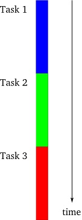
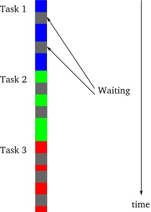
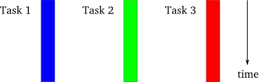
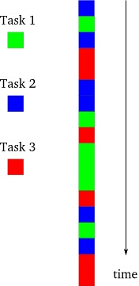

# Python 并发编程

- [编程模型简介](#orgc8b7b60)
  - [同步模型](#org547c83a)
  - [同步多线程/多进程模型](#orgd856fb8)
  - [异步模型](#orgd6b9083)
- [线程](#orgce777a4)
  - [GIL](#org0d77a33)
  - [同步机制](#org38536c9)
    - [Semaphore（信号量）](#orgc1edc20)
    - [Lock（锁）](#org8064168)
    - [RLock（可重入锁）](#org8e70c68)
    - [Event（事件）](#org2fca6f6)
    - [Condition（条件）](#org20b619a)
    - [Queue](#org54182c2)
  - [使用线程编程](#orgf15ca1f)
  - [线程池](#org4311742)
- [进程](#org597a1a0)
  - [进程池](#org457487b)
  - [`multiprocessing.dummy` 模块](#orgbe5548c)
  - [队列](#orgbaa2468)
- [`PoolExecutor`](#orged4d75c)


<a id="orgc8b7b60"></a>

# 编程模型简介

Python官网基于标准库介绍了常见的[并发技术](https://docs.python.org/3/library/concurrency.html)。通常情况下，由于 **I/O限制** 和 **CPU限制** ，程序在运行过程中经常会发生阻塞（等待）。

下面先来介绍3种编程模型：


<a id="org547c83a"></a>

## 同步模型

最简单的执行任务的方式，也是我们平常写程序的时候经常用到的，完成一项工作之后再去做另外一件事情，每次只执行一项任务。



在同步模型中，如果程序中有阻塞，或者被强迫等待，那么其执行过程应该是这样的：



图中灰色的部分代表了一个任务正在等待(阻塞)。


<a id="orgd856fb8"></a>

## 同步多线程/多进程模型

在这种模型中，每一个任务被分配在单独的线程（或进程）当中工作，多个任务可以同时进行。这种模型下，每个任务是被认为是独立的。但是在现实中，很多时候每个线程（或进程）并不是独立的，在运行的过程中需要从其他的线程（或进程）中去获取结果，这样就使各个线程（或进程）的交互和协作变得复杂。




<a id="orgd6b9083"></a>

## 异步模型

每个任务进行交替进行，但是仍在一个进程中。异步模型会比多线程（或多进程）模型更简单些，因为每个任务的运行状态都是可以被我们控制的。虽然在同步模型也可以让任务交替运行，但这往往需要多个线程（或进程）协作才能完成。单线程异步模式可以保证程序运行在一个线程中，即使在一个多进程系统中。




<a id="orgce777a4"></a>

# 线程

对于 **I/O限制** 问题，可以使用 **线程** 来解决。


<a id="org0d77a33"></a>

## GIL

因为[全局解释锁（GIL）](https://wiki.python.org/moin/GlobalInterpreterLock)的存在，Python（特指CPython）的多线程代码并不能利用多核的优势。

```python
import time
import threading


def timethis(func):
    def wrapper(*args, **kwargs):
        start = time.time()
        result = func(*args, **kwargs)
        end = time.time()
        print("Func: '%s' Time: %5.14f" %
              (func.__name__, end - start))
        return result
    return wrapper


def fib(n):
    if n <= 2:
        return 1
    return fib(n-1) + fib(n-2)


@timethis
def nothread():
    fib(35)
    fib(35)


@timethis
def hasthread():
    for i in range(2):
        t = threading.Thread(target=fib, args=(35,))
        t.start()
    main_thread = threading.current_thread()  # threading.main_thread()
    for t in threading.enumerate():
        if t is main_thread:
            continue
        t.join()

nothread()
hasthread()
```

下面是代码运行结果：

    Func: 'nothread' Time: 7.49736499786377
    Func: 'hasthread' Time: 7.77390384674072


<a id="org38536c9"></a>

## 同步机制

Python线程包含多种同步机制，下面依次介绍。


<a id="orgc1edc20"></a>

### Semaphore（信号量）

在多线程编程中，为了防止不同的线程同时对一个公用的资源（比如全部变量）进行修改，需要限制同时访问的数量（通常是1）。信号量同步基于内部计数器，每调用一次<code>acquire()</code>，计数器减1；每调用一次<code>release()</code>，计数器加1。当计数器为0时，<code>acquire()</code>调用被阻塞，直到其他线程调用<code>release()</code>将计数器加1为止。

```python
# semaphore.py
import time
from random import random
from threading import Thread, Semaphore

sema = Semaphore(3)  # 3是信号量的初始值，省略的话，默认是1

def foo(tid):
    with sema:
        print('{} acquire sema'.format(tid))
        wait_time = random() * 2
        time.sleep(wait_time)
    print('{} release sema'.format(tid))

threads = []

for i in range(5):
    t = Thread(target=foo, args=(i,))
    threads.append(t)
    t.start()


for t in threads:
    t.join()
```

上面例子中，限制了同时能访问资源的数量为3。

<code>BoundedSemaphore([value])</code>用于创建一个新的有边界的信号量，其工作方式与<code>Semaphore</code>相同，但<code>release()</code>操作的次数不能超过<code>acquire()</code>操作的次数。


<a id="org8064168"></a>

### Lock（锁）

Lock也可以叫做互斥锁，其实相当于信号量为1。先看一个不加锁的例子：

```python
# nolock.py
import time
from threading import Thread

value = 0

def getlock():
    global value
    new = value + 1
    time.sleep(0.001)  # 使用sleep让线程有机会切换
    value = new

threads = []

for i in range(100):
    t = Thread(target=getlock)
    t.start()
    threads.append(t)

for t in threads:
    t.join()

print(value)
```

不加锁的情况下，结果会远远的小于100。加上互斥锁看看：

```python
# lock.py
import time
from threading import Thread, Lock

value = 0
lock = Lock()

def getlock():
    global value
    with lock:
        new = value + 1
        time.sleep(0.001)
        value = new

threads = []

for i in range(100):
    t = Thread(target=getlock)
    t.start()
    threads.append(t)

for t in threads:
    t.join()

print(value)
```

依赖锁的代码应该保证当出现异常时正确地释放锁。典型的代码如下：

    try:
        lock.acquire()
        # 关键代码部分
        statements
        ...
    finally:
        lock.release()

另外，所有种类的锁还支持上下文管理协议：

    with lock:
        # 关键代码部分
        statements
        ...

<code>with</code>语句自动获取锁，并且在控制流离开上下文时自动释放锁。

注意，编写代码时一般应该避免同时获取多个锁，例如:

    with lock_a:
        # 关键代码部分
        statements
        ...
        with lock_b:
            # B的关键代码部分
            statements
        ...


<a id="org8e70c68"></a>

### RLock（可重入锁）

<code>acquire()</code>能够不被阻塞的被同一个线程调用多次。但是要注意的是<code>release()</code>需要调用与<code>acquire()</code>相同的次数才能释放锁。这允许拥有锁的线程执行嵌套的<code>acquire()</code>和<code>release()</code>操作，在这种情况下，只有最外层的<code>release()</code>操作才能将锁重置为未锁定状态。


<a id="org2fca6f6"></a>

### Event（事件）

事件用于在线程之间通信。一个线程发送/传递事件，另外的线程等待事件的触发。同样用「生产者/消费者」模型的例子：

```python
# event.py
import time
import threading
from random import randint


TIMEOUT = 2


def consumer(event, l):
    t = threading.currentThread()
    while 1:
        event_is_set = event.wait(TIMEOUT)
        if event_is_set:
            try:
                integer = l.pop()
                print('{} popped from list by {}'.format(integer, t.name))
                event.clear()  # 重置事件状态
            except IndexError:  # 为了让刚启动时容错
                pass


def producer(event, l):
    t = threading.currentThread()
    while 1:
        integer = randint(10, 100)
        l.append(integer)
        print('{} appended to list by {}'.format(integer, t.name))
        event.set()	 # 设置事件
        time.sleep(1)


event = threading.Event()
l = []

threads = []

for name in ('consumer1', 'consumer2'):
    t = threading.Thread(name=name, target=consumer, args=(event, l))
    t.start()
    threads.append(t)


p = threading.Thread(name='producer1', target=producer, args=(event, l))
p.start()
threads.append(p)

for t in threads:
    t.join()
```

事件被2个消费者比较平均的接收并处理了。如果使用了<code>wait</code>方法，线程就会等待我们设置事件，这也有助于保证任务的完成。

这段代码不可靠，因为在<code>event.wait()</code>和<code>event.clear()</code>操作之间，生产者可能产生了一个新项。但是，通过清楚事件，在生产者创建一个新项之前，消费者可能看不到这个新项。


<a id="org20b619a"></a>

### Condition（条件）

一个线程等待特定条件，而另一个线程发出特定条件满足的信号。最好说明的例子就是「生产者/消费者」模型：

```python
# condition.py
import time
import threading


def consumer(cond):
    t = threading.current_thread()
    with cond:
        # wait()方法创建了一个名为waiter的锁，并且设置锁的状态为locked。
        # 这个waiter锁用于线程间的通讯
        cond.wait()
        print('{}: Resource is available to consumer'.format(t.name))


def producer(cond):
    t = threading.current_thread()
    with cond:
        print('{}: Making resource available'.format(t.name))
        cond.notify_all()  # 释放waiter锁，唤醒消费者


condition = threading.Condition()

c1 = threading.Thread(name='c1', target=consumer, args=(condition,))
c2 = threading.Thread(name='c2', target=consumer, args=(condition,))
p = threading.Thread(name='p', target=producer, args=(condition,))

c1.start()
time.sleep(1)
c2.start()
time.sleep(1)
p.start()
```

通过运行结果可见，生产者发送通知之后，消费者都收到了。

下面的代码提供了使用条件变量的模板：

```python
import threading

cv = threading.Condition()

def producer():
    while 1:
        cv.acquire()
        produce_item()
        cv.notify()
        cv.release()

def consumer():
    while 1:
        cv.acquire()
        while not item_is_available():
            cv.wait()  # 等待项出现
        cv.release()
        consume_item()
```

使用条件变量时需要注意的是，如果存在多个线程等待同一个条件，<code>notify()</code>操作可能唤醒它们中的一个或多个（这种行为通常取决于底层的操作系统）。因此，始终有这样的可能：某个线程被唤醒后，发现它等待的条件不存在了。这解释了为什么在<code>consumer()</code>中使用<code>while</code>循环。如果线程醒来，但是生成的项已经消失，它就会去等待下一个信号。


<a id="org54182c2"></a>

### Queue

队列在并发开发中是最常用的。借助「生产者/消费者」模式来理解：生产者把生产的「消息」放入队列，消费者从这个队列中对去对应的消息执行。

关心如下4个方法就好了：

-   <code>put</code>向队列中添加一个项。
-   <code>get</code>从队列中删除并返回一个项。
-   <code>task_done</code>当某一项任务完成时调用。
-   <code>join</code>阻塞直到所有的项目都被处理完。

```python
# queue_exp.py
import time
import threading
from random import random
import queue

q = queue.Queue()


def double(n):
    return n * 2


def producer():
    while 1:
        wt = random()
        time.sleep(wt)
        q.put((double, wt))


def consumer():
    while 1:
        task, arg = q.get()
        print(arg, task(arg))
        q.task_done()


for target in(producer, consumer):
    t = threading.Thread(target=target)
    t.start()
```

这就是最简单的队列架构。

<code>queue</code>模块还自带了<code>PriorityQueue</code>（带有优先级）和<code>LifoQueue</code>（后进先出）2种特殊队列。这里展示下线程安全的优先级队列的用法。

<code>PriorityQueue</code>要求<code>put</code>的数据的格式是<code>(priority_number, data)</code>，看看下面的例子：

```python
# priority_queue.py
import time
import threading
from random import randint
from queue import PriorityQueue

q = PriorityQueue()


def double(n):
    return n * 2


def producer():
    count = 0
    while 1:
        if count > 5:
            break
        pri = randint(0, 100)
        print('put :{}'.format(pri))
        q.put((pri, double, pri))  # (priority, func, args)
        count += 1


def consumer():
    while 1:
        if q.empty():
            break
        pri, task, arg = q.get()
        print('[PRI:{}] {} * 2 = {}'.format(pri, arg, task(arg)))
        q.task_done()
        time.sleep(0.1)


t = threading.Thread(target=producer)
t.start()
time.sleep(1)
t = threading.Thread(target=consumer)
t.start()
```

其中消费者是故意让它执行的比生产者慢很多，为了节省篇幅，只随机产生5次随机结果。

可以看到<code>put</code>时的数字是随机的，但是<code>get</code>的时候先从优先级更高（数字小表示优先级高）开始获取的。


<a id="orgf15ca1f"></a>

## 使用线程编程

尽管在Python中可以使用各种锁和同步原语的组合编写非常传统的多线程程序，但一种首推的编程方式要优于其他所有编程方式——即将多线程程序组织为多个独立任务的集合，这些任务之间通过消息队列进行通信。

```python
import threading
from queue import Queue

class WorkerThread(threading.Thread):
    def __init__(self, *args, **kwargs):
        threading.Thread.__init__(self, *args, **kwargs)
        self.input_queue = Queue()

    def send(self, item):
        self.input_queue.put(item)

    def close(self):
        self.input_queue.put(None)
        self.input_queue.join()

    def run(self):
        while 1:
            item = self.input_queue.get()
            if item is None:
                break
            # process item
            print(item)
            self.input_queue.task_done()
        # finished
        self.input_queue.task_done()
        return


w = WorkerThread()
w.start()
w.send("Hello")
w.send("world")
w.close()
```


<a id="org4311742"></a>

## 线程池

面向对象开发中，创建和销毁对象是很费时间的，因为创建一个对象要获取内存资源或者其它更多资源。无节制的创建和销毁线程是一种极大的浪费。可以考虑把执行完任务的线程不销毁而进行重复利用，仿佛就是把这些线程放进一个池子，一方面可以控制同时工作的线程数量，一方面也避免了创建和销毁产生的开销。

线程池在标准库中其实是有体现的，只是在官方文章中基本没有被提及：

```python
from multiprocessing.pool import ThreadPool
pool = ThreadPool(5)
pool.map(lambda x: print(x**2), range(5))
# [0, 1, 4, 9, 16]

with ThreadPool(5) as pool:
    pool.map(lambda x: print(x**2), range(5))
# [0, 1, 4, 9, 16]
```


<a id="org597a1a0"></a>

# 进程

对于 **CPU限制** 问题，可以使用 **进程** 来解决。

由于GIL（全局解释锁）的问题，多线程并不能充分利用多核处理器，如果是一个CPU计算型的任务，应该使用多进程模块<code>multiprocessing</code>。它的工作方式与线程库完全不同，但是两种库的语法却非常相似。<code>multiprocessing</code>给每个进程赋予单独的Python解释器，这样就规避了全局解释锁所带来的问题。

首先把之前的例子改成单进程和多进程的方式来对比下性能：

```python
import time
import multiprocessing


def timethis(func):
   def wrapper(*args, **kwargs):
       start = time.time()
       result = func(*args, **kwargs)
       end = time.time()
       print("Func: '%s' Time: %5.14f" %
             (func.__name__, end - start))
       return result
   return wrapper


def fib(n):
    if n <= 2:
        return 1
    return fib(n-1) + fib(n-2)


@timethis
def nomultiprocess():
    fib(35)
    fib(35)


@timethis
def hasmultiprocess():
    jobs = []
    for i in range(2):
        p = multiprocessing.Process(target=fib, args=(35,))
        p.start()
        jobs.append(p)

    for p in jobs:
        p.join()

nomultiprocess()
hasmultiprocess()
```

运行结果：

    Func: 'nomultiprocess' Time: 7.33435273170471
    Func: 'hasmultiprocess' Time: 3.80848598480225

虽然多进程让效率差不多翻了倍，但是需要注意，其实这个时间就是2个执行<code>fib(35)</code>，最慢的那个进程的执行时间而已。


<a id="org457487b"></a>

## 进程池

**任务的执行周期决定于CPU核数和任务分配算法。** 上面例子中<code>hasmultiprocess</code>函数的用法非常中规中矩且常见，但是更好的写法是使用<code>Pool</code>，也就是对应线程池的进程池：

```python
import time
from multiprocessing import Pool

def timethis(func):
    def wrapper(*args, **kwargs):
        start = time.time()
        result = func(*args, **kwargs)
        end = time.time()
        print("Func: '%s' Time: %5.14f" %
              (func.__name__, end - start))
        return result
    return wrapper


def fib(n):
    if n <= 2:
        return 1
    return fib(n-1) + fib(n-2)

@timethis
def multi_process():
    with Pool(2) as pool:
        pool.map(fib, [35] * 2)

multi_process()
```

其中<code>map</code>方法用起来和内置的<code>map</code>函数一样，却有多进程的支持。


<a id="orgbe5548c"></a>

## `multiprocessing.dummy` 模块

<code>multiprocessing.dummy</code>模块虽然在多进程模块的代码中，但是接口和多线程的接口基本一样。其与<code>multiprocessing</code>模块的区别：<code>dummy</code>模块是多线程，而<code>multiprocessing</code>是多进程， **api** 都是通用的。所以可以很方便将代码在多线程和多进程之间切换。

> <code>multiprocessing.dummy</code>replicates the API of multiprocessing but is no more than a wrapper around the threading module.

如果分不清任务是CPU密集型还是IO密集型，用如下2个方法分别试：

```python
from multiprocessing import Pool
from multiprocessing.dummy import Pool
```

```python
import time
# from multiprocessing import Pool
from multiprocessing.dummy import Pool
from urllib.request import urlopen


urls = ['http://www.edu2act.cn/course/?page=%s'% p
        for p in range(2, 15)]

def timethis(func):
    def wrapper(*args, **kwargs):
        start = time.time()
        result = func(*args, **kwargs)
        end = time.time()
        print("Func: '%s' Time: %5.14f" %
              (func.__name__, end - start))
        return result
    return wrapper


@timethis
def map_run(urls):
    for r in map(urlopen, urls):
        print(len(r.read()))

@timethis
def pool_run(urls, processes=4):
    with Pool(processes=4) as pool:
        results = pool.map(urlopen, urls)
    for r in results:
        print(len(r.read()))

map_run(urls)
pool_run(urls)
```

哪个速度快就用哪个。编码时尽量写兼容的方式，这样在多线程/多进程之间切换非常方便。

经验和技巧：如果一个任务拿不准是CPU密集还是I/O密集型，且没有其它不能选择多进程方式的因素，都统一直接上多进程模式。


<a id="orgbaa2468"></a>

## 队列

多线程有Queue模块实现队列，多进程模块也包含了Queue类，它是线程和进程安全的。现在给之前的生产者/消费者的例子添加点难度，也就是用2个队列：一个队列用于存储待完成的任务，另外一个用于存储任务完成后的结果：

```python
import time
from multiprocessing import Process, JoinableQueue, Queue
from random import random


tasks_queue = JoinableQueue()
results_queue = Queue()


def double(n):
    return n * 2


def producer(in_queue):
    while 1:
        wt = random()
        time.sleep(wt)
        in_queue.put((double, wt))
        if wt > 0.9:
            in_queue.put(None)
            print('stop producer')
            break


def consumer(in_queue, out_queue):
    while 1:
        task = in_queue.get()
        if task is None:
            break
        func, arg = task
        result = func(arg)
        in_queue.task_done()
        out_queue.put(result)

processes = []

p = Process(target=producer, args=(tasks_queue,))
p.start()
processes.append(p)

p = Process(target=consumer, args=(tasks_queue, results_queue))
p.start()
processes.append(p)

tasks_queue.join()

for p in processes:
    p.join()

while 1:
    if results_queue.empty():
        break
    result = results_queue.get()
    print('Result:', result)
```

和线程的队列例子比较变化很多：

1.  生产者已经不会持续的生产任务了，如果随机到的结果大于0.9就会给任务队列<code>tasks_queue</code>put一个<code>None</code>，然后把循环结束掉
2.  消费者如果收到一个值为<code>None</code>的任务，就结束，否则执行从<code>tasks_queue</code>获取的任务，并把结果<code>put</code>进<code>results_queue</code>
3.  生产者和消费者都结束后（有<code>join</code>方法保证），从<code>results_queue</code>挨个获取执行结果并打印出来

进程的<code>Queue</code>类并不支持<code>task_done</code>和<code>join</code>方法，需要使用特别的<code>JoinableQueue</code>，而搜集结果的队列<code>results_queue</code>使用<code>Queue</code>就足够了。


<a id="orged4d75c"></a>

# `PoolExecutor`

Python标准库提供了<code>threading</code>和<code>multiprocessing</code>模块编写相应的 **多线程/多进程** 代码，但是当项目达到一定的规模，频繁创建/销毁进程或者线程是非常消耗资源的，这个时候我们就要编写自己的线程池/进程池，以空间换时间。

从Python3.2开始一个叫做<code>concurrent.futures</code>被纳入了标准库，而在Python2它属于第三方的 **futures** 库，需要手动安装：

```sh
pip install futures
```

这个模块中有2个类：<code>ThreadPoolExecutor</code>和<code>ProcessPoolExecutor</code>，也就是对<code>threading</code>和<code>multiprocessing</code>的进行了高级别的抽象，直接对编写线程池/进程池提供了直接的支持，暴露出统一的接口，帮助开发者非常方便的实现异步调用。

<code>concurrent.futures</code>模块的基础是<code>Executor</code>，<code>Executor</code>是一个抽象类，它不能被直接使用。但是它提供的两个子类<code>ThreadPoolExecutor</code>和<code>ProcessPoolExecutor</code>却是非常有用，顾名思义两者分别被用来创建线程池和进程池的代码。我们可以将相应的 **tasks** 直接放入线程池/进程池，不需要维护Queue来操心死锁的问题，线程池/进程池会自动帮我们调度。

**Future** 可以理解为一个在未来完成的操作，这是异步编程的基础，传统编程模式下比如我们操作<code>queue.get</code>的时候，在等待返回结果之前会产生阻塞，cpu不能让出来做其他事情。而Future的引入帮助我们在等待的这段时间可以完成其他的操作。

```python
import time
from concurrent.futures import ProcessPoolExecutor, as_completed

NUMBERS = range(25, 38)

def fib(n):
    if n <= 2:
        return 1
    return fib(n-1) + fib(n-2)


start = time.time()
with ProcessPoolExecutor(max_workers=3) as executor:
    for num, result in zip(NUMBERS, executor.map(fib, NUMBERS)):
        print('fib({}) = {}'.format(num, result))

print('COST: {}'.format(time.time() - start))
```

```python
# example4.py
import concurrent.futures
import urllib.request

URLS = ['http://httpbin.org', 'http://example.com/', 'https://api.github.com/']


def load_url(url):
    with urllib.request.urlopen(url, timeout=60) as conn:
        return conn.read()


# We can use a with statement to ensure threads are cleaned up promptly
with concurrent.futures.ThreadPoolExecutor(max_workers=3) as executor:
    for url, data in zip(URLS, executor.map(load_url, URLS)):
        print('%r page is %d bytes' % (url, len(data)))
```

从运行结果可以看出，<code>map</code>是按照<CODE>URLS</CODE>列表元素的顺序返回的，并且写出的代码更加简洁直观，可以根据具体的需求任选一种。

    'http://httpbin.org' page is 12373 bytes
    'http://example.com/' page is 1270 bytes
    'https://api.github.com/' page is 2039 bytes

除了用<code>map</code>，另外一个常用的方法是<code>submit</code>。如果你要提交的任务的函数是一样的，就可以简化成<code>map</code>。但是假如提交的任务函数是不一样的，或者执行的过程可能出现异常（使用<code>map</code>执行过程中发现问题会直接抛出错误）就要用到<code>submit</code>：

```python
from concurrent.futures import ThreadPoolExecutor, as_completed

NUMBERS = range(30, 35)


def fib(n):
    if n == 34:
        raise Exception("Don't do this")
    if n<= 2:
        return 1
    return fib(n-1) + fib(n-2)


with ThreadPoolExecutor(max_workers=3) as executor:
    future_to_num = {executor.submit(fib, num): num for num in NUMBERS}
    for future in as_completed(future_to_num):
        num = future_to_num[future]
        try:
            result = future.result()
        except Exception as e:
            print('raise an exception: {}'.format(e))
        else:
            print('fib({}) = {}'.format(num, result))


with ThreadPoolExecutor(max_workers=3) as executor:
    for num, result in zip(NUMBERS, executor.map(fib, NUMBERS)):
        print('fib({}) = {}'.format(num, result))
```

```python
# example3.py
import concurrent.futures
import urllib.request

URLS = ['http://httpbin.org', 'http://example.com/', 'https://api.github.com/']

def load_url(url, timeout):
    with urllib.request.urlopen(url, timeout=timeout) as conn:
        return conn.read()

# We can use a with statement to ensure threads are cleaned up promptly
with concurrent.futures.ThreadPoolExecutor(max_workers=3) as executor:
    # Start the load operations and mark each future with its URL
    future_to_url = {executor.submit(load_url, url, 60): url for url in URLS}
    for future in concurrent.futures.as_completed(future_to_url):
        url = future_to_url[future]
        try:
            data = future.result()
        except Exception as exc:
            print('%r generated an exception: %s' % (url, exc))
        else:
            print('%r page is %d bytes' % (url, len(data)))
```

从运行结果可以看出，<code>as_completed</code>不是按照<CODE>URLS</CODE>列表元素的顺序返回的：

    'http://example.com/' page is 1270 bytes
    'http://httpbin.org' page is 12373 bytes
    'https://api.github.com/' page is 2039 bytes

上面说到的<code>map</code>，这不是进程（线程）池的效果吗？看起来确实是的：

```python
import time
from multiprocessing.pool import Pool

NUMBERS = range(25, 38)

def fib(n):
    if n <= 2:
        return 1
    return fib(n-1) + fib(n-2)


start = time.time()

pool = Pool(3)
for num, result in zip(NUMBERS, pool.map(fib, NUMBERS)):
    print('fib({}) = {}'.format(num, result))

print('COST: {}'.format(time.time() - start))
```

好像代码量更小。
