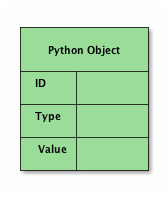

# 对象和类

本章我们学习如何使用自定义的数据结构：**对象**。

## 什么是对象

“对象是 Python 中对数据的一种抽象，Python程序中所有数据都是通过对象或对象之间的关系来表示的。”

在 Python 中，所有的对象都具有**id**、**type**、**value**三个属性：



其中**id**代表内存地址，可以通过内置函数`id()`查看，而**type**表示对象的类别，不同的类别意味着该对象拥有的属性和方法等，可以通过`type()`方法查看。

对象既包含数据（attribute，称为特性），也包含代码（函数，也称为方法），它是某一类具体事物的特殊实例。

对象作为 Python 中的基本单位，可以被创建、命名或删除。Python中一般不需要手动删除对象，其垃圾回收机制会自动处理不再使用的对象，当然如果需要，也可以使用`del`语句删除某个变量；所谓命名则是指给对象贴上一个名字标签，方便使用，也就是声明或赋值变量。

对于一些 Python 内置类型的对象，通常可以使用特定的语法生成，例如**数字**直接使用阿拉伯数字字面量，**字符串**使用引号`''`，**列表**使用`[]`，**字典**使用`{}`，**函数**使用`def`语法等，这些对象的类型都是 Python 内置的。

当你想创建一个其他类型的对象时，首先必须定义一个类，用以指明该类型的对象所包含的内容（特性和方法）。

## 类与实例

在Python中通常使用`class`语句来定义一个类（类对象），与其他对象不同的是，`class`定义的对象（类）可以用于产生新的对象（实例）。


```python
class Person():
    pass


def who(obj):
    print(id(obj), type(obj))


someone = Person()
who(someone)
```

上面的例子中`Person`是我们创建的一个新的类，通过调用`Person()`可以获得一个`Person`类型的实例对象，我们将其赋值为`someone`，就成功创建了一个与所有内置对象类型不同的对象`someone`，它的类型为`__main__.Person`。到这里，我们可以将Python中一切的对象分为两种：

1. 可以用来生成新对象的类，包括内置的`int`、`str`以及上面定义的`Person`等；
2. 由类生成的实例对象，包括内置类型的数字、字符串、以及上面定义的类型为`__main__.Person`的`someone`。

在实践中不得不考虑的一些细节性问题：

1. 需要一些方便的机制来实现面向对象编程中的继承、重载等特性；
2. 需要一些固定的流程让我们可以在生成实例化对象的过程中执行一些特定的操作。

## 类的方法

在类的内部，使用`def`关键字可以为类定义一个方法，与一般函数定义不同，方法必须包含参数`self`，且为第一个参数。

Python使用特殊的对象初始化方法（构造函数，在生成对象时调用）`__init__`，当创建了这个类的实例时就会调用该方法，与C++中构造函数类似。如果我们想重新定义一下上面的`Person`类，比如为其添加一个`name`参数，可以这样：


```python
class Person():
    def __init__(self, name):
        self.name = name

someone = Person('小明')
print(someone)
print(someone.name)
```

上面代码执行流程：
1. 查看`Person`类的定义；
2. 在内存中实例化（创建）一个新的对象；
3. 调用对象的`__init__`方法，将这个新创建的对象作为`self`参数传入，并将另一个参数（'小明'）作为`name`传入；
4. 将`name`的值存入对象；
5. 返回这个新的对象；
6. 将名字`someone`与这个对象关联。


```python
class Person():
    def __init__(self, name, age):
        self.name = name
        self.age = age

    def get_name(self):
        return self.name

    def set_name(self, name):
        self.name = name

    def get_age(self):
        return self.age

    def set_age(self, age):
        self.age = age


someone = Person('小明', 14)
print(someone.name)
print(someone.get_name())
someone.set_name('李小明')
print(someone.name)
print(someone.age)
someone.age = 15
print(someone.get_age())
```

## 继承

从已有类中衍生出新的类，添加或修改部分功能，能提高代码复用。使用继承得到的新类会自动获得旧类中的所有方法，而不需要进行复制。

你可以在新类里面定义自己额外需要的方法，或者按照需要对继承的方法进行修改。


```python
class A():
    def foo(self):
        print('A.foo')

class B(A):
    def foo(self):
        """覆盖父类中的方法
        """
        # 使用super()调用父类的方法
        super().foo()
        print('B.foo')

    def bar(self):
        """在子类中添加父类中没有的新方法
        """
        print('B.bar')


a = A()
a.foo()
b = B()
b.foo()
b.bar()
```

上面代码示例展示了如何在子类中覆盖（override）父类的方法，在子类中如何调用父类的方法，以及在子类中添加父类中没有的新方法。


## 在类中封装属性名

Python中类的所有特性都是公开的，Python程序员不去依赖语言特性去封装数据，而是通过遵循一定的属性和方法命名规约来达到这个效果。

第一个约定是任何以单下划线`_`开头的名字都应该是内部实现。


```python
class A():
    def __init__(self):
        self._internal = 0  # An internal attribute
        self.public = 1  # A public attribute

    def public_method(self):
        """A public method
        """
        pass

    def _internal_method(self):
        pass
```

Python并不会真的真的阻止别人访问内部名称。但是如果你这么做肯定是不好的，可能会导致脆弱的代码。同时还要注意到，使用下划线开头的约定同样适用于模块名和模块级别函数。

另外，使用双下划线`__`开始会导致访问名称变成其他形式。


```python
class B():
    def __init__(self):
        self.__private = 0

    def __private_method(self):
        pass

    def public_method(self):
        self.__private_method()
        pass
```

上面的类B中，私有特性和方法会被重命名为`_B__private`和`_B__private_method`。这样做的目的就是为了继承时无法被覆盖。例如：


```python
class C(B):
    def __init__(self):
        super().__init__()
        self.__private = 1  # does not override B.__private

    # does not override B.__private_method()
    def __private_method(self):
        pass
```

上面示例中，私有名称`__private`和`__private_method`会被重命名为`_C__private`和`_C__private_method`，这个跟父类B中的名称是完全不同的。

上面提到的两种不同的编码约定（单下划线和双下划线）来命名私有属性应该选择哪一种？大多数而言，你应该让你的非公共名称以单下划线开头。但是，如果你清楚你的代码会涉及到子类，并且有些内部属性应该在子类中隐藏起来，那么你需要考虑使用双下划线方案。

还有一点，有时候你定义的一个变量和某个保留关键字冲突，这时候可以使用单下划线作为后缀：


```python
lambda_ = 2.0  # trailing _ to avoid clash with lambda keyword
```

上面并不使用单下划线前缀的原因是它避免误解它的使用初衷（如使用单下划线前缀的目的是为了防止命名冲突而不是指明这个属性是私有的）。通过使用单下划线后缀可以解决这个问题。


## 创建可管理的属性

有时候我们想要控制对实例对象特性（attribute）的访问，比如将其设置为只读（无法修改）或者添加类型检查、合法性验证等，这时候我们可以将其定义为一个属性（property）。例如，下面的代码定义了一个property，增加对一个属性简单的类型检查。


```python
class Person():
    def __init__(self, first_name):
        self.first_name = first_name

    def get_first_name(self):
        return self._first_name

    def set_first_name(self, value):
        if not isinstance(value, str):
            raise TypeError('Expected a string')
        self._first_name = value

    def del_first_name(self):
        raise AttributeError("Can't delete attribute")

    first_name = property(get_first_name, set_first_name, del_first_name)


a = Person('Mark')
print(a.first_name)
a.first_name = 42
```


```python
del a.first_name
```

上例中，使用`property()`函数定义了一个属性`first_name`，`property()`函数的第一个参数是**getter**方法，第二个参数是**setter**方法，第三个参数是**deleter**方法。属性（property）的一个关键特征是它看上去跟普通的特性（attribute）没什么两样，但是访问它的时候会自动触发**getter**、**setter**、**deleter**方法。

在实现一个property的时候，底层数据（如果有的话）仍然需要存储在某个地方。因此，在**getter**和**setter**方法中，你会看到对`_firse_name`属性的操作，这也是实际数据保存的地方。另外，你可能还会问为什么`__init__()`方法中设置了`self.first_name`而不是`self._first_name`。在这个例子中，我们创建一个property的目的就是在设置attribute的时候进行检查。因此，你可能想在初始化的时候也进行这种类型检查。通过设置`self.first_name`，自动调用**setter**方法，这个方法里面会进行参数的检查，否则就是直接访问`self._first_name`了。

另一种定义属性的方法是使用装饰器。例如，上面的例子可以写成这样：


```python
class Person():
    def __init__(self, first_name):
        self.first_name = first_name

    @property
    def first_name(self):
        return self._first_name

    @first_name.setter
    def first_name(self, value):
        if not isinstance(value, str):
            raise TypeError('Expected a string')
        self._first_name = value

    @first_name.deleter
    def first_name(self):
        raise AttributeError("Can't delete attribute")


a = Person('Mark')
print(a.first_name)
a.first_name = 42
```


```python
del a.first_name
```

上述代码中有三个相关联的方法，这三个方法的名字都必须一样。`@property`用于指示**getter**方法，它使得`first_name`成为一个属性。`@first_name.setter`用于指示**setter**方法，`@first_name.deleter`用于指示**deleter**方法。需要强调的是只有在`first_name`属性被创建后，后面的两个装饰器`@first_name.setter`和`@first_name.deleter`才能被定义。

*注意：*不要写没有做任何其他额外操作的property。

另外，property还是一种定义动态计算attribute的方法。这种类型的特性并不会被实际的存储，而是在需要的时候计算出来。


```python
import math


class Circle():
    def __init__(self, radius):
        self.radius = radius

    @property
    def area(self):
        return math.pi * self.radius ** 2

    @property
    def perimeter(self):
        return 2 * math.pi * self.radius


c = Circle(4.0)
print(c.radius)
print(c.area)
print(c.perimeter)
```

在这里，我们通过使用property，将所有的访问接口形式统一起来，对半径、周长和面积的访问都是通过属性访问，就跟访问简单的attribute是一样的。如果不这样做的话，那么就要在代码中混合使用简单属性访问和方法调用。

如果你没有指定某一特性的**setter**属性（`@area.setter`），那么将无法在类的外部对它的值进行设置。这对于只读的特性非常有用：


```python
c.area = 10  # will raise AttributeError
```

另外，使用property时，如果你改变了某个特性的定义，只需要在类定义里修改相关代码即可，不需要在每一处调用修改。


```python
class Circle():
    def __init__(self, diameter):
        self.radius = diameter / 2

    @property
    def area(self):
        return math.pi * self.radius ** 2

    @property
    def perimeter(self):
        return 2 * math.pi * self.radius


c = Circle(8.0)
print(c.radius)
print(c.area)
print(c.perimeter)
```

## 方法类型

在类中定义的方法有3种，分别是：

* **实例方法**（instance method），以`self`作为第一个参数，当其被调用时，Python会把调用该方法的对象作为`self`参数传入。
* **类方法**（class method），用`@classmethod`装饰器指定，第一个参数是类本身，通常写作`cls`，作用于整个类，对类作出的任何改变会对它的所有实例对象产生影响。
* **静态方法**（static method），用`@staticmethod`修饰，其参数既不需要`self`，也不需要`cls`，其功能既不影响类也不影响类的实例，仅仅为了组织代码的方便。


```python
class A():
    count = 0
    def __init__(self):
        A.count += 1

    def exclaim(self):
        print('I am an A!')

    @classmethod
    def kids(cls):
        print("A has", cls.count, "little objects.")

    @staticmethod
    def static_method():
        print('Static method called!')


easy_a = A()
breezy_a = A()
wheezy_a = A()
A.kids()
easy_a.exclaim()
A.exclaim(easy_a)
A.static_method()
```

## 鸭子类型

在程序设计中，鸭子类型（duck typing）是动态类型的一种风格。在这种风格中，一个对象有效的语义，不是由继承自特定的类或实现特定的接口，而是由"当前方法和属性的集合"决定。支持“鸭子类型”的语言的解释器/编译器会在解释或编译时推断对象的类型。在鸭子类型中，关注的不是对象的类型本身，而是它是如何使用的。例如，在不使用鸭子类型的语言中，我们可以编写一个函数，它接受一个类型为“鸭子”的对象，并调用它的“走”和“叫”方法。在使用鸭子类型的语言中，这样的一个函数可以接受一个任意类型的对象，并调用它的“走”和“叫”方法。如果这些需要被调用的方法不存在，那么将引发一个运行时错误。任何拥有这样的正确的“走”和“叫”方法的对象都可被函数接受的这种行为引出了以上表述，这种决定类型的方式因此得名。

在动态语言设计中，可以解释为无论一个对象是什么类型的，只要它具有某类型的行为（方法），则它就是这一类型的实例，而不在于它是否显示的实现或者继承。比如，如果一个对象具备迭代器所具有的所有行为特征，那它就是迭代器了。而如何保证一个对象实现某一种类型的所有特征，则依靠**协议**。


## 特殊方法（魔法方法）

特殊方法是指Python类中以双下划线`__`开头和结尾的方法，比如`__init__`，根据类的定义以及传入的参数对新创建的对象进行初始化。

### 构造和初始化

但是当调用`x = SomeClass()`的时候，`__init__`并不是第一个被调用的方法。实际上，还有一个叫做`__new__`的方法，来构造这个实例。然后给在开始创建时候的初始化函数来传递参数。在对象生命周期的另一端，也有一个`__del__`方法（如果`__new__`和`__init__`是对象的构造器的话，那么`__del__`就是析构器），它定义的是当一个对象进行垃圾回收时候的行为。当一个对象在删除的时需要更多的清洁工作的时候此方法会很有用，比如套接字对象或者是文件对象。

```python
from os.path import join

class FileObject:
    '''给文件对象进行包装从而确认在删除时关闭文件流'''

    def __init__(self, filepath='~', filename='sample.txt'):
        # 读写模式打开一个文件
        self.file = open(join(filepath, filename), 'r+')

    def __del__(self):
        self.file.close()
        del self.file
```

### 用于比较的魔术方法

```
__lt__(self, other)    self < other
__le__(self, other)    self <= other
__eq__(self, other)    self == other
__ne__(self, other)    self != other
__gt__(self, other)    self > other
__ge__(self, other)    self >= other
```

举一个例子，创建一个类来表示一个词语。我们也许会想要比较单词的字典序(通过字母表)，通过默认的字符串比较的方法就可以实现，但是我们也想要通过一些其他的标准来实现，比如单词长度或者音节数量。在这个例子中，我们来比较长度实现。以下是实现代码:


```python
class Word(str):
    """
    存储单词的类，定义比较单词的几种方法
    """

    def __new__(cls, word):
        # 注意我们必须要用到__new__方法，因为str是不可变类型
        # 所以我们必须在创建的时候将它初始化
        if ' ' in word:
            print("Value contains spaces. Truncating to first space.")
            word = word[:word.index(' ')] #单词是第一个空格之前的所有字符
        return str.__new__(cls, word)

    def __gt__(self, other):
        return len(self) > len(other)
    def __lt__(self, other):
        return len(self) < len(other)
    def __ge__(self, other):
        return len(self) >= len(other)
    def __le__(self, other):
        return len(self) <= len(other)

foo = Word('foo')
bar = Word('bar')
foo > bar  # False
foo < bar  # False
foo >= bar  # True
foo <= bar  # True
```

### 普通算数操作符

```
__add__(self, other)      加法 +
__sub__(self, other)      减法 -
__mul__(self, other)      乘法 *
__floordiv__(self, other) 整数除法 //
__truediv__(self, other)  真除法 /
__mod__(self, other)      取模算法 %
__divmod___(self, other)  内置divmod()函数
__pow__(self, other)      指数运算 **
__lshift__(self, other)   左移 <<
__rshift__(self, other)   右移 >>
__and__(self, other)      按位与 &
__or__(self, other)       按位或 |
__xor__(self, other)      按位异或 ^
```

### 其他种类的魔法方法

* `__str__(self)`  等价于`str(self)`，定义如何打印对象信息，`print()`、`str()`以及字符串格式化相关方法都会用到`__str__()`。
* `__repr__(self)` 等价于`repr(self)`，交互式解释器适用此方法输出变量。
* `__len__(self)` 等价于`len(self)`。


```python
class Word():
    def __init__(self, text):
        self.text = text
    def __eq__(self, word2):
        return self.text.lower() == word2.text.lower()
    def __str__(self):
        return self.text
    def __repr__(self):
        return 'Word("' + self.text + '")'

first = Word('ha')
print(first)
first
```

更多源于魔法方法的内容可查看Python在线文档（ https://docs.python.org/3/reference/datamodel.html#special-method-names ）。

## 组合

类与类之间的2种关系：

* **is-a** 子类是父类的一种特殊情况
* **has-a** 一种类型包含另一种类型


```python
class Bill():
    def __init__(self, description):
        self.description = description


class Tail():
    def __init__(self, length):
        self.length = length


class Duck():
    def __init__(self, bill, tail):
        self.bill = bill
        self.tail = tail

    def about(self):
        print('This duck has a', self.bill.description,
              'bill and a', self.tail.length, 'tail.')


tail = Tail('long')
bill = Bill('wide orange')
duck = Duck(bill, tail)
duck.about()
```

## 命名元组

命名元组是元组的子类，其允许使用名称而不是只是索引访问其元素的元组！


```python
from collections import namedtuple

# 创建命名元组
Student = namedtuple('Student', 'first_name last_name grade')
# Student = namedtuple('Student', ['first_name', 'last_name', 'grade'])
astudent = Student('Lisa', 'Simpson', 'A')
# 使用字典构造命名元组
# intro = {'first_name': 'Lisa', 'last_name': 'Simpson', 'grade': 'A'}
# astudent = Student(**intro)
print(type(Student))
print(type(astudent))
print(astudent)
print(astudent.first_name)
print(astudent.last_name)
print(astudent.grade)
```

将命名元组以有序字典（OrderedDict）形式返回：


```python
astudent._asdict()
```

命名元组是不可变的，但可替换其中某些域的值并返回一个新命名元组：


```python
bstudent = astudent._replace(first_name='Bart', grade='C')
bstudent
```

使用命名元组的好处：

* 可以当作不可变对象来使用；
* 使用点号`.`对特性进行访问，使得代码更清晰简单；
* 与使用对象相比，使用命名元组在时间和空间上效率更高。

## 类、对象还是模块？

用最简单的方式解决问题。使用元组（命名元组）、字典和列表等内置数据类型要比使用模块更加简单，使用类则更加复杂。
